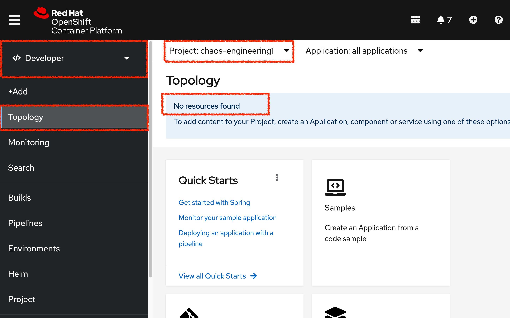
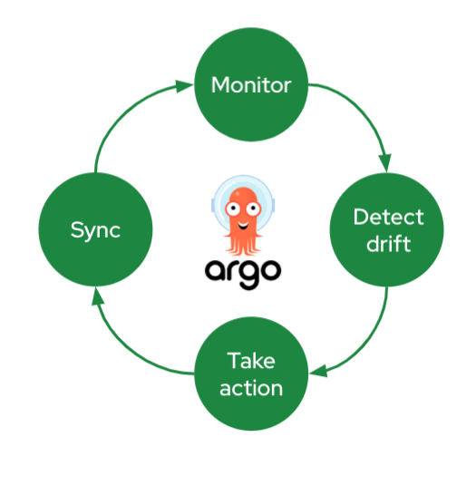
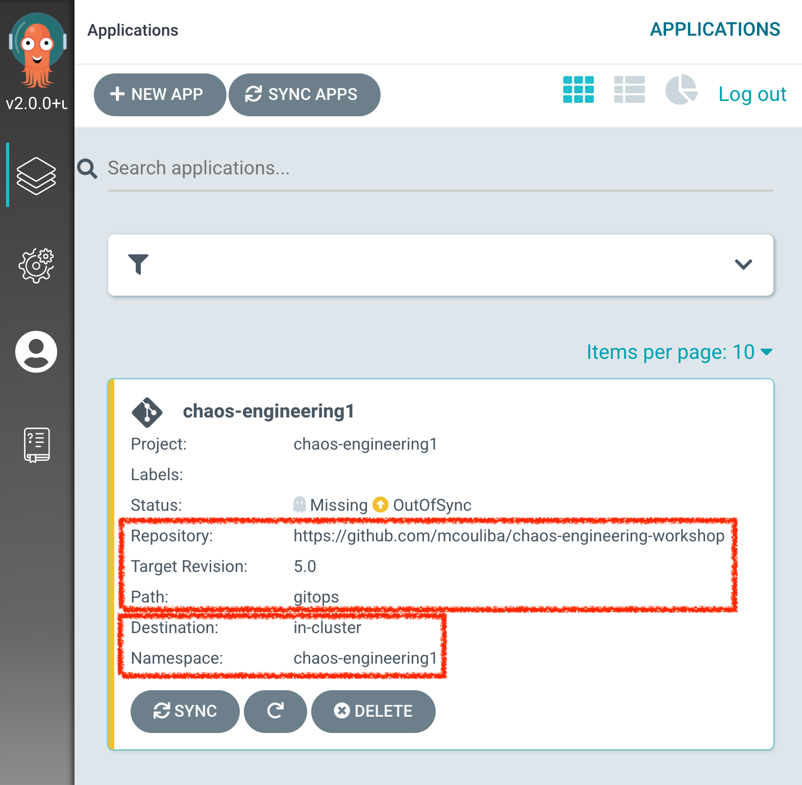
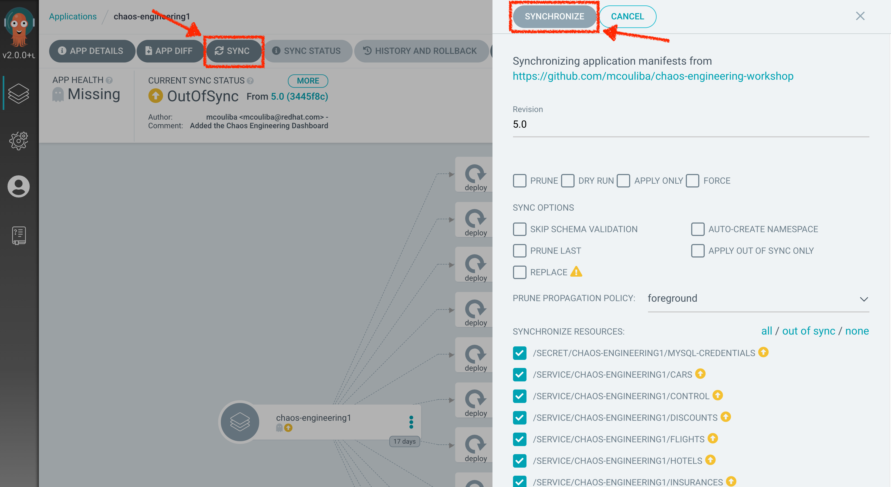
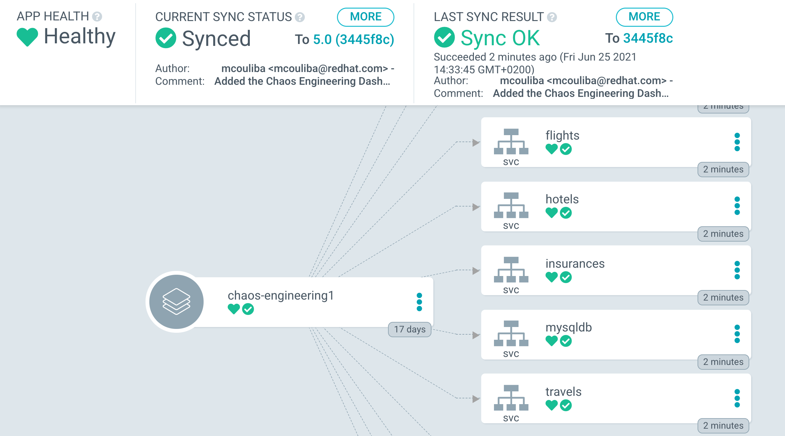
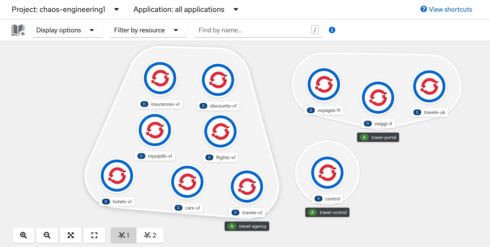

:markup-in-source: verbatim,attributes,quotes
:navtitle: Get your Chaos environment
:CHE_URL: http://codeready-workspaces.%APPS_HOSTNAME_SUFFIX%
:USER_ID: %USER_ID%
:OPENSHIFT_PASSWORD: %OPENSHIFT_PASSWORD%
:OPENSHIFT_CONSOLE_URL: https://console-openshift-console.%APPS_HOSTNAME_SUFFIX%/topology/ns/chaos-engineering{USER_ID}/graph
:GITOPS_URL: https://argocd-server-argocd.%APPS_HOSTNAME_SUFFIX%
:GITOPS_WORKSHOP_GIT_URL: %WORKSHOP_GIT_REPO%/tree/%WORKSHOP_GIT_REF%/gitops

= Get your Chaos environment

_10 MINUTE EXERCISE_

As a Chaos Engineer, you will need an environment to deploy applications to evaluate
In this section, you will explore OpenShift and deploy an application using **Argo CD**.

image::images/explore-discover.png[explore-discover, 800]

== What is Red Hat OpenShift?

[sidebar]
--

image::images/Logo-Red_Hat-OpenShift.png[Red Hat OpenShift, 300]

**Red Hat® OpenShift®** enables enterprises to build highly agile, scalable architectures with enhanced cluster security that can be deployed at any location.

**Red Hat® OpenShift®** offers automated installation, upgrades, and lifecycle management throughout the container stack—the operating system, https://www.openshift.com/learn/topics/kubernetes/?hsLang=en-us[Kubernetes] and cluster services, and applications—on any cloud.
--

== Log in to the OpenShift Web Console

OpenShift ships with a web-based console that will allow users to
perform various tasks via a browser.

`*Click on the 'OpenShift Console' button below*`

[link={OPENSHIFT_CONSOLE_URL}]
[window="_blank"]
[role='params-link']

`*Enter your username and password (user{USER_ID}/{OPENSHIFT_PASSWORD})*` and 
then log in. After you have authenticated to the web console, you will be presented with a
list of projects that your user has permission to work with. 

`*Select the 'Developer View' then your 'chaos-engineering{USER_ID}'*` to be taken to the project overview page
which will list all of the routes, services, deployments, and pods that you have
running as part of your project. There's nothing there now, but that's about to
change.

== What is OpenShift GitOps?

[sidebar]
--

image::images/argocd-logo.png[Argo CD, 200]

**OpenShift GitOps** is a service available on top of OpenShift. 

**OpenShift GitOps** is an OpenShift add-on which provides Argo CD and other tooling to enable teams to implement GitOps workflows for cluster configuration and application delivery. 

**OpenShift GitOps** is available as an operator in the OperatorHub and can be installed with  a simple one-click experience. Once installed, users can deploy Argo CD instances using Kubernetes custom resources.

image::images/gitops-model.png[gitops-model, 500]
--

=== Argo CD features

* Cluster and application configuration versioned in Git
* Automatically syncs configuration from Git to clusters
* Drift detection, visualization and correction
* Granular control over sync order for complex rollouts
* Rollback and rollforward to any Git commit
* Manifest templating support (Helm, Kustomize, etc)
* Visual insight into sync status and history

== Log in to OpenShift GitOps (Argo CD)

`*Click on the 'OpenShift GitOps' button below*`

[link={GITOPS_URL}]
[window="_blank"]
[role='params-link']

Then `*log in as user{USER_ID}/{OPENSHIFT_PASSWORD}*`. Once completed, you will be redirected to the following page which lists the **Argo CD Applications**.

An **Argo CD Application** represents a deployed application instance in a given environment. It is defined by two key pieces of information:

* **source** reference to the desired state in Git (repository, revision, path, environment): **{GITOPS_WORKSHOP_GIT_URL}**
* **destination** reference to the target cluster and namespace: **'chaos-engineering{USER_ID}' namespace from the current OpenShift cluster (in-cluster)**

The **Argo CD Application** status is initially in yellow, means **OutOfSync** state, since the application has yet to be 
deployed into the **'chaos-engineering{USER_ID}'** namespace, and no Kubernetes resources have been created.

== Sync/Deploy the application

To deploy the application, `*click on your 'chaos-engineering{USER_ID}' application box then, click on 'Sync > Synchronize'*`.

[TIP]
====
This task retrieves the manifests from the Git Repository and performs _kubectl apply_ command of 
the manifests. 
====

After a couple of seconds, you should see **everything in green**. Your application is now running. You can now view its resource components,logs, events, and assessed health status.

In the link:{OPENSHIFT_CONSOLE_URL}[OpenShift Web Console^, role='params-link'], from the **Developer view**,
select the `**chaos-engineering{USER_ID}**` to be taken to the project overview page.

You can see that all resources of your application have been created by Argo CD. 

Now you are ready to get started with the labs!