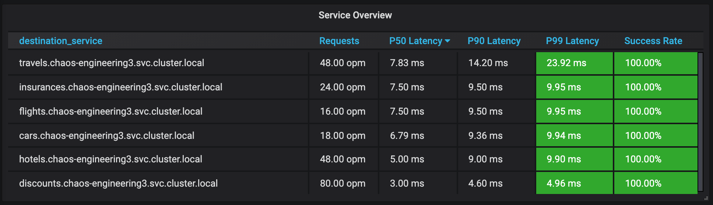
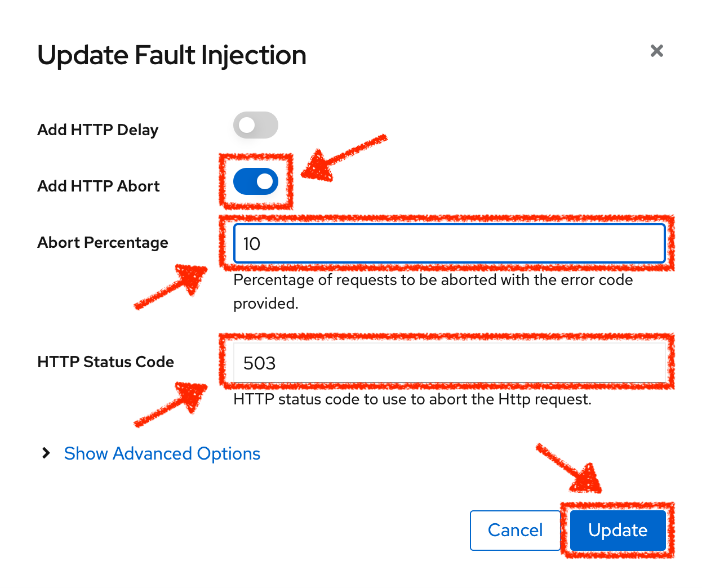
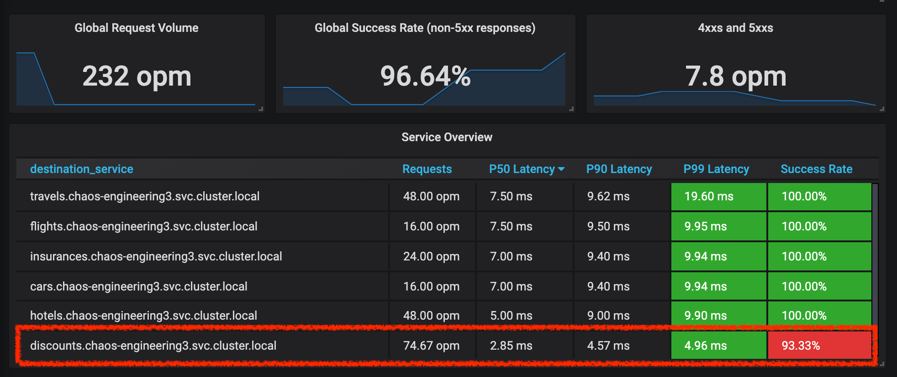
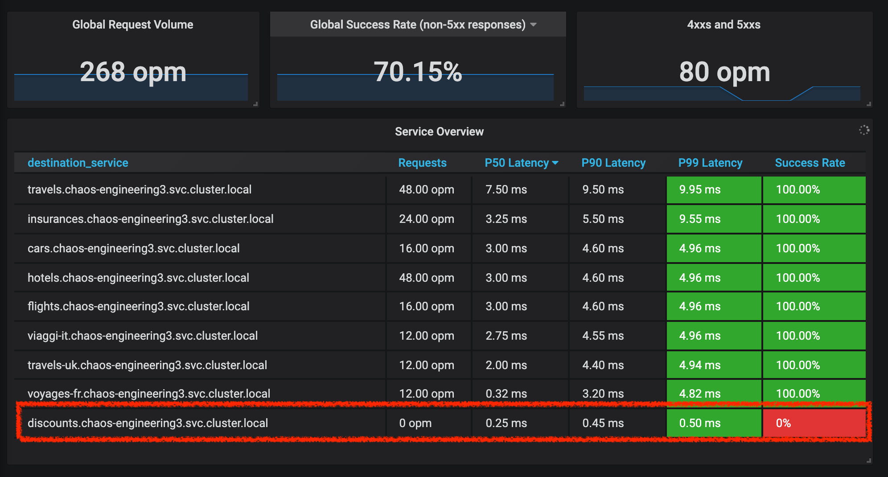

:markup-in-source: verbatim,attributes,quotes
:CHE_URL: http://codeready-workspaces.%APPS_HOSTNAME_SUFFIX%
:USER_ID: %USER_ID%
:OPENSHIFT_PASSWORD: %OPENSHIFT_PASSWORD%
:OPENSHIFT_CONSOLE_URL: https://console-openshift-console.%APPS_HOSTNAME_SUFFIX%/topology/ns/chaos-engineering{USER_ID}/graph
:APPS_HOSTNAME_SUFFIX: %APPS_HOSTNAME_SUFFIX%
:KIALI_URL: https://kiali-istio-system.%APPS_HOSTNAME_SUFFIX%
:GRAFANA_URL: https://grafana-istio-system.%APPS_HOSTNAME_SUFFIX%
:GITOPS_URL: https://argocd-server-argocd.%APPS_HOSTNAME_SUFFIX%

= Chaos Experiment 2: Unavailable Service

_10 MINUTE PRACTICE_

Previously, you have seen how big the impact is on the application when a small network latency problem occurs on one non-critital services.
Let's see how the application will occur when this same service is unavailable. For this second experiment, we will test the following hypothesis:

_**Unavailable 'discount' service should NOT impact the Service Level Objective (SLO) of the Travel Service**_

== Define the steady state

Like in the previous lab, we will keep the same steady state 

**99% of requests are successful and served within 50 ms** 

We will be able to see how a different type of failure of the same service could impact the behaviour of our application.

== Run the Chaos experiment

In the {KIALI_URL}[Kiali Console^, role='params-link'], from the **'Graph' view**, `*right-click on the 'discounts' service and select 'Details'*`

image::images/kiali-right-click-service.png[Kiali - Right Click Service,400]

You will be redirected to the Service Details page. 

`*Click on the 'Actions' > 'Fault Injection'*`

image::images/kiali-add-fault-injection.png[Kiali - Add Fault Injection,900]

`*Add HTTP Abort by entering the following settings:*`

.HTTP Abort Settings
[%header,cols=3*]
|===
|Parameter
|Value
|Description

|Add HTTP Delay 
|**Disabled**
|

|Add HTTP Abort 
|**Enabled**
|

|Abort Percentage
|**10**
|

|HTTP Status Code
|**503**
|

|===

`*Click on the 'Update' button*`. 

**10% of the traffic of the 'discounts' service is failing with a 503 HTTP code**. Now let's see the impact of the application.

== Analyze the Chaos outcome

In the {GRAFANA_URL}[Chaos Engineering Dashboard], you can see the result of the chaos experiment.

**All services, except for the 'discounts' service, performs very well without any errors (100% success)**. 

You can increase the percentage of error injection until making the 'discounts' service completely unavailable. 

In the {KIALI_URL}[Kiali Console^, role='params-link'], `*update the HTTP Abort strategy of the 'discounts' service as follows:*`

`*Add HTTP Abort by entering the following settings:*`

.HTTP Abort Settings
[%header,cols=3*]
|===
|Parameter
|Value
|Description

|Add HTTP Delay 
|Disabled
|

|Add HTTP Abort 
|Enabled
|

|Abort Percentage
|**100**
|

|HTTP Status Code
|503
|

|===

Contrary to the outcome with the Latency experiment, you tell the application is resilient when the 'discounts' service is completely down (unavailable).
So your hypothesis is validated:

_**Unavailable 'discounts' services DO NOT impact the Service Level Objective (SLO) of the Travel Service**_

== Rollback the Chaos experiment

In {GITOPS_URL}[Argo CD^, role='params-link'], `*click on 'Sync > Synchronize'*`.

image::images/argocd-rollback-sync.png[Argo CD - Sync Application, 900]

Finally, in the {GRAFANA_URL}[Chaos Engineering Dashboard], `*please check the application is back in the steady state.

image::images/grafana-steady-state.png[Grafana - Steady State,700]
