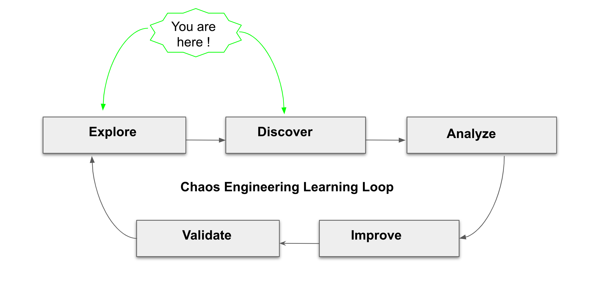
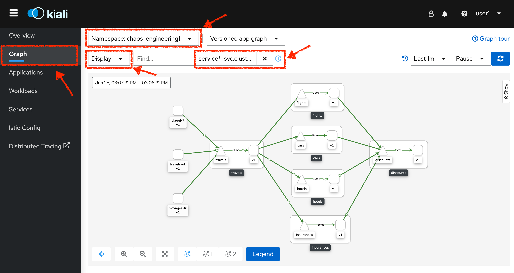
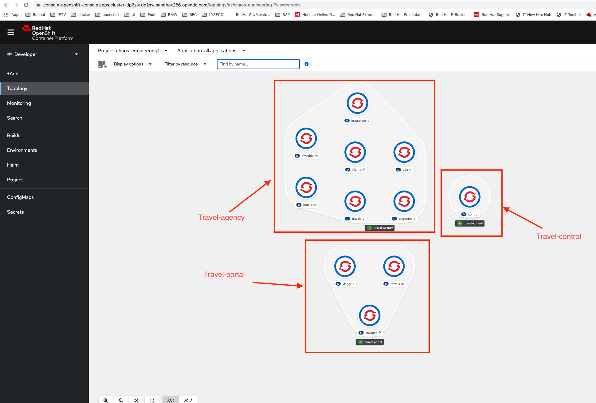
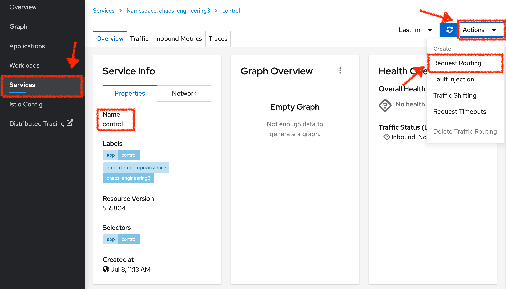
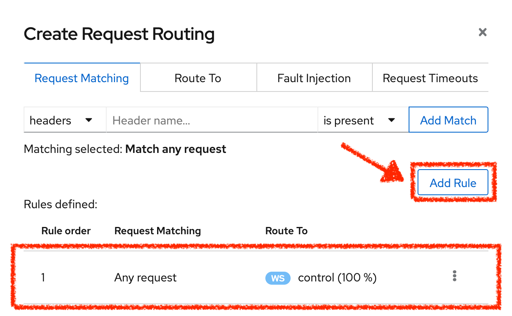
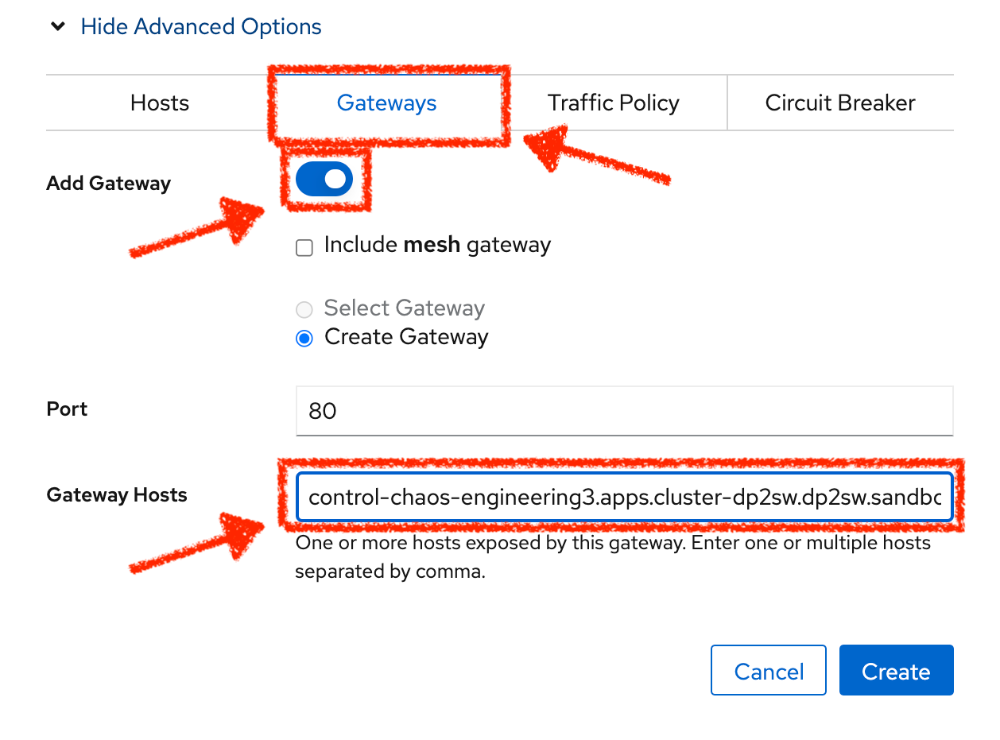

:markup-in-source: verbatim,attributes,quotes
:CHE_URL: http://codeready-workspaces.%APPS_HOSTNAME_SUFFIX%
:USER_ID: %USER_ID%
:OPENSHIFT_PASSWORD: %OPENSHIFT_PASSWORD%
:OPENSHIFT_CONSOLE_URL: https://console-openshift-console.%APPS_HOSTNAME_SUFFIX%/topology/ns/chaos-engineering{USER_ID}/graph
:APPS_HOSTNAME_SUFFIX: %APPS_HOSTNAME_SUFFIX%
:KIALI_URL: https://kiali-istio-system.%APPS_HOSTNAME_SUFFIX%

= Explore the Application

_10 MINUTE PRACTICE_

== What is OpenShift Service Mesh?

[sidebar]
.OpenShift Service Mesh
****

**OpenShift Service Mesh** is also a service available on top of OpenShift.

As applications evolve into collections of decentralized services, managing communications and security between those services becomes more difficult. 

**Red Hat OpenShift Service Mesh** is a service that provides behavioral insight and operational control over the Service Mesh, providing a uniform way to connect, secure, and monitor microservice applications.

What’s in it?

[tabs]
====
Service Mesh::
+
--
image::images/istio-logo.png[Istio, 200]

**Istio** is an open-source project for integrating and managing traffic flow across services. It works in concert with an underlying cluster manager (like Kubernetes). Centralized components, sidecar proxies, and node agents work together to create the data and control planes over a distributed application.
--

Observability::
+
--
image::images/kiali-logo.png[Kiali, 200]

Observability helps users see communication pathways between services, how they’re being managed, and how traffic is flowing in near-real time for easier management and troubleshooting. 

OpenShift Service Mesh uses **Kiali**, an open source project, to view configuration, monitor traffic, and analyze traces.
--

Monitoring::
+
--
image:grafana-logo.png[Grafana, 200]
image:prometheus-logo.png[Prometheus, 200]

OpenShift Service Mesh uses **Grafana** and **Prometheus** to provide out of the box metrics and monitoring for all services.
--

Tracing::
+
--
image:jaeger-logo.png[Istio, 200]
image:elastic-search-logo-color-horizontal.png[Elastic Search, 200]

Tracing allows you to track a single request as it makes its way between different services - or even inside a service - providing insight into the entire request process from start to finish. 
OpenShift Service Mesh uses **Jaeger**, an open, distributed tracing system and **Elasticsearch**, a distributed, free and open search and analytics engine to capture distributed traces providing a “per request” view  for isolating bottlenecks between services.
--
====

****

== Observability with Kiali

**Kiali** provides an interactive graph view of your namespace in real time, being able to display the interactions at several levels (applications, versions, workloads), with contextual information and charts on the selected graph node or edge.

`*Click on the 'Kiali' button below*`

[link={KIALI_URL}]
[window="_blank"]
[role='params-link']

Then, `*log in with OpenShift as user{USER_ID}/{OPENSHIFT_PASSWORD}'*`

image::images/kiali-login.png[Kiali- Log In,300]

Select the  **'Graph' view**, from the side menu bar and `*enter the following configuration*`:

The outcome is a graph with all the services, connected by the requests going through them. 
You can see how the services interact with each other. 

.Graph Settings
[%header,cols=2*]
|===
|Parameter
|Value

|Namespace 
|**chaos-engineering{USER_ID}**

|Type Graph
|**Versioned app graph**

|Display
|**'Response Time'** checked

**'Traffic Animation'** checked

|Hide...
|**service*=svc.cluster.local**

|===

== Understand the Application

Before continuing we will describe the application used in this workshop.

This demo application deploys several services into 1 namespace.

* **'chaos-engineering{USER_ID}'** namespace

Inside the **'chaos-engineering{USER_ID}' namespace** we see 3 parts 

* Travel-portal
* Travel-agency
* Travel-control 

The Travels Demo application simulates two business domains:

=== Travel Portal

In a first part called **travel-portal** there will be deployed several travel shops, where users can search for and book flights, hotels, cars or insurance.

The shop applications can behave differently based on request characteristics like channel (web or mobile) or user (new or existing).

These workloads may generate different types of traffic to imitate different real scenarios.

All the portals consume a service called travels.

=== Travel Agency

A second part called **travel-agency** will host a set of services created to provide quotes for travel.

A main travels service will be the business entry point for the travel agency. It receives a destination city and a user as parameters and it calculates all elements that compose a travel budget: airfare, lodging, car reservation and travel insurance.

Each service can provide an independent quote and the travels service must then aggregate them into a single response.

Additionally, some users, like registered users, can have access to special discounts, managed as well by an external service.

Service relations between services of the applications can be described in the following diagram:

image::images/travels-demo-design.png[travel-demo-design - Travel demo Project deployed by Argo CD , 800]

=== Travel Portal and Travel Agency flow

A typical flow consists of the following steps:

<.> A portal queries the travels service for available destinations.

<.> Travels service queries the available hotels and returns to the portal shop.

<.> A user selects a destination and a type of travel, which may include a flight and/or a car, hotel and insurance.

<.> Cars, Hotels and Flights may have available discounts depending on user type.

=== Travel Control

The **travel-control**  runs a **business dashboard** with two key features:

* Allow setting changes for every travel shop simulator (traffic ratio, device, user and type of travel).

* Provide a **business** view of the total requests generated from the **travel-control** service to the **travel-agency** services, organized by business criteria as grouped per shop, per type of traffic and per city.

== Access the Application

To access to the dashboard (UI) of the application, we will need to create a specific Istio Ingress component.

In the {KIALI_URL}[Kiali Console^, role='params-link'], from the **'Services' view**, `*click on the 'control' service > 'Actions' > 'Request Routing'*`

`*Click on 'Add Rule' button*` to redirect all the ingress traffic to the 'control' service*`:

Then `*click on 'Show Advanced Options' and entering the following information*`:

.Gateways Settings
[%header,cols=3*]
|===
|Parameter
|Value
|Description

|Add Gateway 
|**Enabled**
|

|Gateway Hosts
|**control-chaos-engineering{USER_ID}.{APPS_HOSTNAME_SUFFIX}**
|
|===

You can use this COPY/PASTE value to avoid Error
[source,kiali,subs="{markup-in-source}",role=copypaste]
.kiali
----
control-chaos-engineering{USER_ID}.{APPS_HOSTNAME_SUFFIX}
----

Finally, `*click on the 'Create' button*`. You can now access the Travel Control Dashboard using the following URL, http://control-chaos-engineering{USER_ID}.{APPS_HOSTNAME_SUFFIX}[^, role='params-link'].

image::images/travels-dashboard.png[travels-dashboard - Business Dashboard , 800]
