:markup-in-source: verbatim,attributes,quotes
:CHE_URL: http://codeready-workspaces.%APPS_HOSTNAME_SUFFIX%
:USER_ID: %USER_ID%
:OPENSHIFT_PASSWORD: %OPENSHIFT_PASSWORD%
:OPENSHIFT_CONSOLE_URL: https://console-openshift-console.%APPS_HOSTNAME_SUFFIX%/topology/ns/chaos-engineering{USER_ID}/graph
:APPS_HOSTNAME_SUFFIX: %APPS_HOSTNAME_SUFFIX%
:KIALI_URL: https://kiali-istio-system.%APPS_HOSTNAME_SUFFIX%
:GRAFANA_URL: https://grafana-istio-system.%APPS_HOSTNAME_SUFFIX%
:GITOPS_URL: https://argocd-server-argocd.%APPS_HOSTNAME_SUFFIX%

= Chaos Experiment 1: Network latency

_30 MINUTE PRACTICE_

In production, it is more common to have slow services than broken services. **Latency** measures the delay between an action and a response. For this first experiment, we will test the following hypothesis:

_**A small network latency should not impact the Service Level Objective (SLO) of the Travel Service**_

== Define the steady state

In the {GRAFANA_URL}[Chaos Engineering Dashboard, role='params-link'], you can analyze the different metrics and define the Steady State for our chaos experiment.
First, `*select the following variables on the dashboard*`:

.Dashboard Settings
[%header,cols=3*]
|===
|Parameter
|Value
|Description

|Namespace 
|**chaos-engineering{USER_ID}**
|

|Service
|**travels.chaos-engineering{USER_ID}.svc.cluster.local**
|

|===

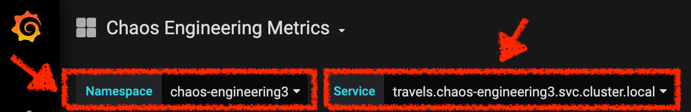

From the **Namespace section**, you can tell that **99% of requests are successful and served within 50 ms**  

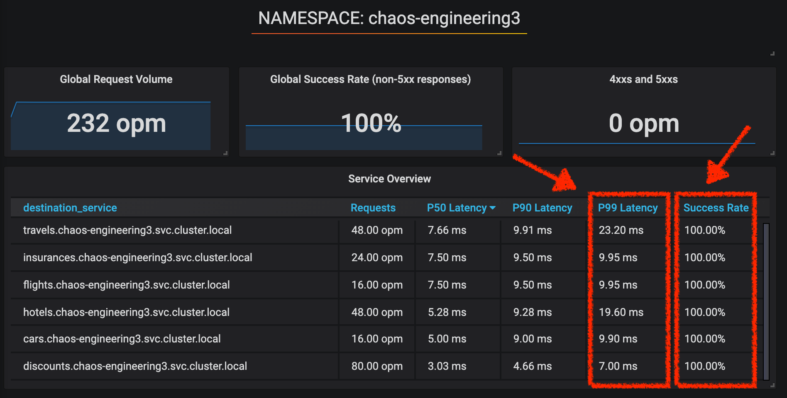

So we will define this SLO as "steady-state".

`*Click on 'Service Overview' > Edit*`

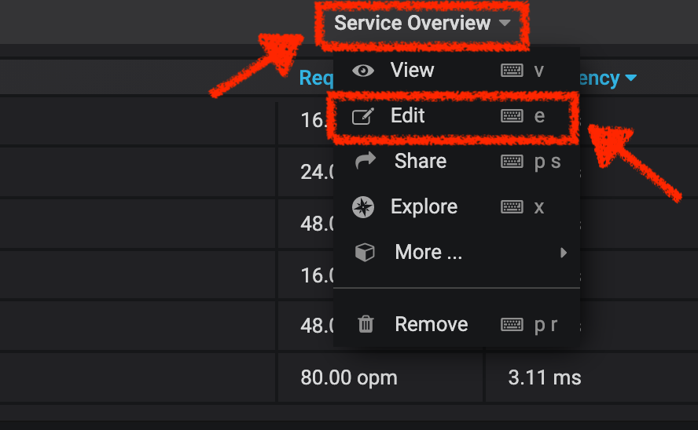

Then, `*click on 'Visualization Settings' icon on the left hand sidebar, scroll down to find the 'P99 Latency (Value #D)' rule and enter the following information for Thresholds*`

.P99 Latency Thresholds Settings
[%header,cols=3*]
|===
|Parameter
|Value
|Description

|Thresholds 
|**50,100**
|

|Color Mode
|**Cell**
|

|Colors
|**Green/Yellow/Red** (click on the 'invert' button if needed)
|

|===

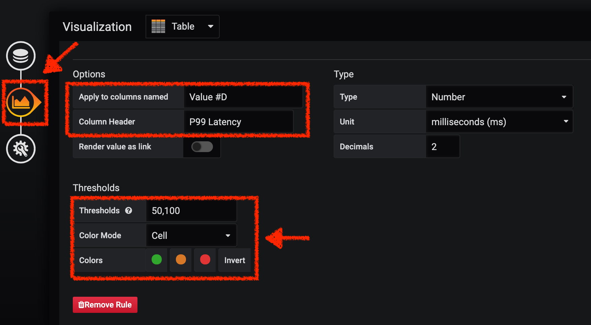

`*Scroll down again and to find the 'Success Rate (Value #E)' rule and enter the following information for Thresholds*`

.Success Rate Thresholds Settings
[%header,cols=3*]
|===
|Parameter
|Value
|Description

|Thresholds 
|**0.95,0.99**
|

|Color Mode
|**Cell**
|

|Colors
|**Red/Yellow/Green** (click on the 'invert' button if needed)
|

|===

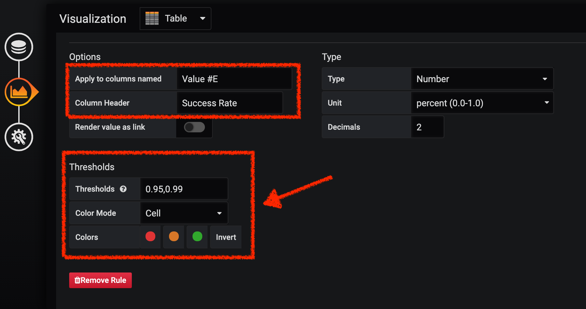

Once done, you should have the following outcome (all green).

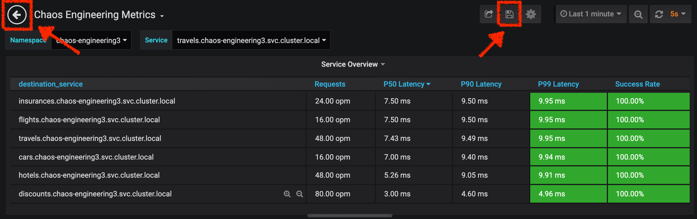

`*Click on the 'Disk' icon to save and go back to the Dashboard.*`

== Run the Chaos experiment

In the {KIALI_URL}[Kiali Console^, role='params-link'], from the **'Graph' view**, `*right-click on the 'discounts' service and select 'Details'*`

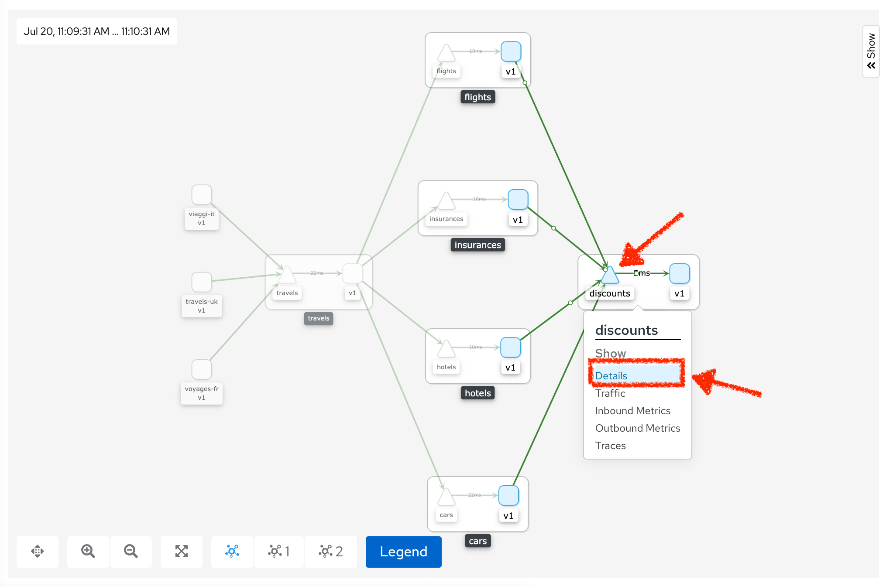

You will be redirected to the Service Details page. 

`*Click on the 'Actions' > 'Fault Injection'*`

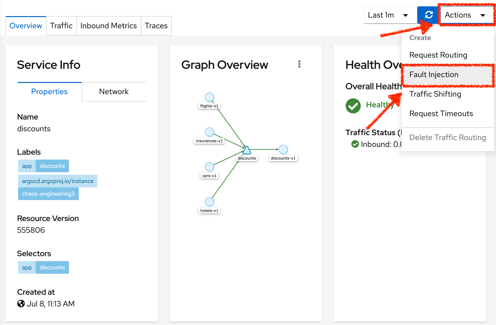

`*Add HTTP Delay by entering the following settings:*`

.HTTP Delay Settings
[%header,cols=3*]
|===
|Parameter
|Value
|Description

|Add HTTP Delay 
|**Enabled**
|

|Delay Percentage
|**5**
|

|Fixed Delayed
|**1s**
|

|===

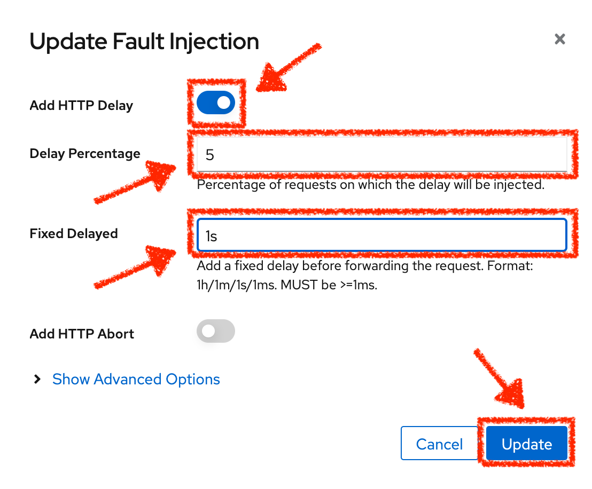

`*Click on the 'Update' button*`. 

**5% of the traffic of the 'discounts' service has now 1 second of delay.**

== Analyze the Chaos outcome

Now let's see the impact of the application.

In the {GRAFANA_URL}[Chaos Engineering Dashboard], you can see the result of the chaos experiment.

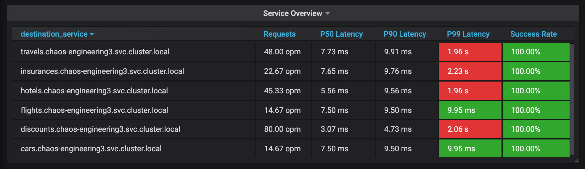

From the **'Service Overview'** panel or **'Request Duration'** for the 'travels' service, you can tell the following about the small network latency based on our hypothesis:

- there is no impact on the Success Rate of the overall requests (100%)
- there is a huge impact on the performance of the application. 

Indeed, just 1 second of delay on 5% of the traffic of one dependant service induces **a latency propagation of ~2 seconds across the entire system**.

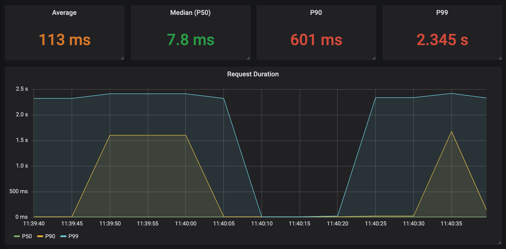

In conclusion, you can tell **the application is not resilient to a small network latency**. To reduce or fix this phenomenon, you could configure the autoscaling or implement a cache mechanism across the different services of the applications.

== Improve the Resiliency

To contain this latency propagation, you are going to apply the *Retry* pattern to all services calling the delayed 'discounts' services.

Retries can improve the application resiliency against transcient problems such as  a temporarily overloaded service or network like we simulate in our experiment.

Instead of failing directly or waiting too long, we could retry N number of times to get the desired output with the desired response time before considering as failed.

`*Configure the Retry pattern for the following services*`

[tabs]
====
cars::
+
--
In the {KIALI_URL}[Kiali Console^, role='params-link'], from the **'Services' view**, `*click on the 'cars' service > 'Actions' > 'Request Timeouts'*`

`*Add HTTP Retry by entering the following settings:*`

.HTTP Retry Settings
[%header,cols=3*]
|===
|Parameter
|Value
|Description

|Add HTTP Retry 
|**Enabled**
|

|Attempts
|**5**
|

|Per Try Timeout
|**20ms**
|

|===

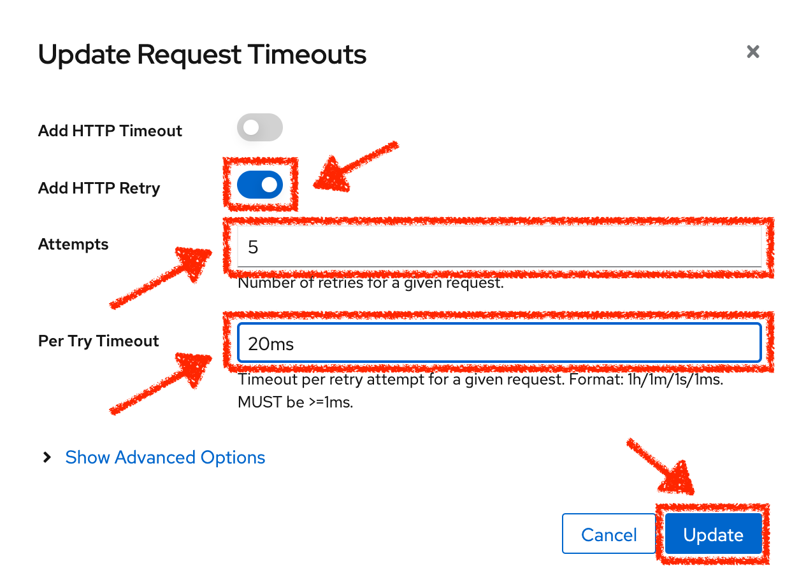

`*Click on the 'Update' button*`.
--

flights::
+
--
In the {KIALI_URL}[Kiali Console^, role='params-link'], from the **'Services' view**, `*click on the 'flights' service > 'Actions' > 'Request Timeouts'*`

`*Add HTTP Retry by entering the following settings:*`

.HTTP Retry Settings
[%header,cols=3*]
|===
|Parameter
|Value
|Description

|Add HTTP Retry 
|**Enabled**
|

|Attempts
|**5**
|

|Per Try Timeout
|**20ms**
|

|===

`*Click on the 'Update' button*`.
--

hotels::
+
--
In the {KIALI_URL}[Kiali Console^, role='params-link'], from the **'Services' view**, `*click on the 'hotels' service > 'Actions' > 'Request Timeouts'*`

`*Add HTTP Retry by entering the following settings:*`

.HTTP Retry Settings
[%header,cols=3*]
|===
|Parameter
|Value
|Description

|Add HTTP Retry 
|**Enabled**
|

|Attempts
|**5**
|

|Per Try Timeout
|**20ms**
|

|===

`*Click on the 'Update' button*`.
--

insurances::
+
--
In the {KIALI_URL}[Kiali Console^, role='params-link'], from the **'Services' view**, `*click on the 'insurances' service > 'Actions' > 'Request Timeouts'*`

`*Add HTTP Retry by entering the following settings:*`

.HTTP Retry Settings
[%header,cols=3*]
|===
|Parameter
|Value
|Description

|Add HTTP Retry 
|**Enabled**
|

|Attempts
|**5**
|

|Per Try Timeout
|**20ms**
|

|===

`*Click on the 'Update' button*`.
--
====

== Validate the Improvement

Back into the {GRAFANA_URL}[Chaos Engineering Dashboard], you can tell that we manage to contain the Latency propagation by **not exceeding 100 ms in general** using the Retry pattern while the 'discounts' service still has the 1s latency issue.

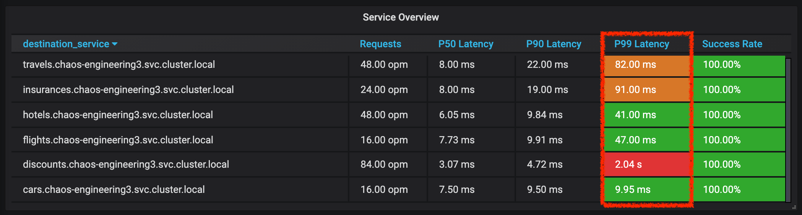

You can see more detail on the 'Request Duration' panel for the 'travels' service

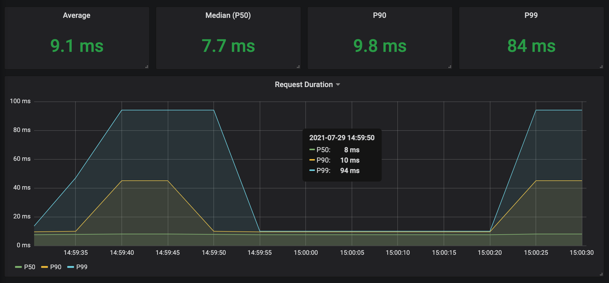

== Rollback the Chaos experiment

There is nothing more simple than rollbacking all configurations you have done during this lab with Argo CD.

In {GITOPS_URL}[Argo CD^, role='params-link'], `*click on 'Sync > Synchronize'*`.

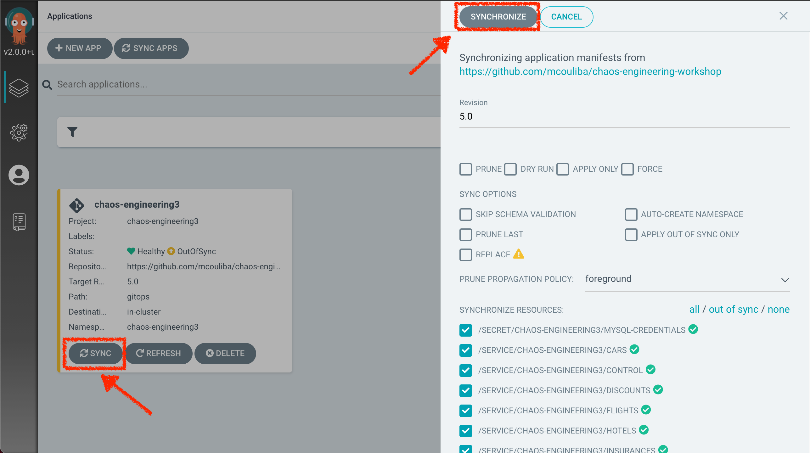

Finally, in the {GRAFANA_URL}[Chaos Engineering Dashboard], `*please check the application is back in the steady state*`.

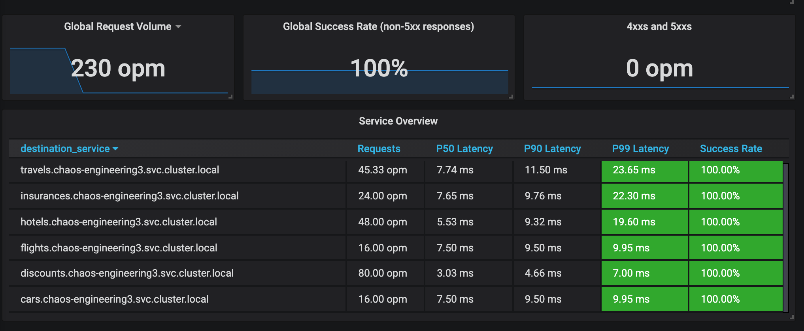