:markup-in-source: verbatim,attributes,quotes
:CHE_URL: http://codeready-workspaces.%APPS_HOSTNAME_SUFFIX%
:USER_ID: %USER_ID%
:OPENSHIFT_PASSWORD: %OPENSHIFT_PASSWORD%
:KIALI_URL: https://kiali-istio-system.%APPS_HOSTNAME_SUFFIX%
:GRAFANA_URL: https://grafana-istio-system.%APPS_HOSTNAME_SUFFIX%
:COOLSTORE_HOMEPAGE: http://web-chaos-engineering{USER_ID}.%APPS_HOSTNAME_SUFFIX%
:DASHBOARD_GIT_URL: https://raw.githubusercontent.com/mcouliba/chaos-engineering-workshop/%WORKSHOP_GIT_REF%/grafana/chaos-engineering-dashboard.json

= Define and monitor Chaos metrics

_20 MINUTE PRACTICE_

== Why do you Need Metrics?

As described in the **Chaos Engineering process** we are currently in a **Steady-state hypothesis**. It means we have to set **metrics** to indicate that the system is working in an expected way from a business perspective, and within a given set of tolerances.

**Steady state** means that you can measure that the system is working in an expected way. In this case, that normal behavior is that the system will meet its **SLOs** ( **S**ervice **L**evel **O**bjective). 

Instead of asking the question: is the service up or down?

We ask the question: **how many requests are we successfully serving for a given time ? **

[tabs]
====
Service Level Indicator (SLI)::
+
--
An **SLI** is a service level indicator—a carefully defined quantitative measure of some aspect of the level of service that is provided. We recommend to read this great SRE book later https://sre.google/sre-book/service-level-objectives/[Chapter 4- Service Level objectives (Google SRE book)]

A set of agreed upon observable and measurable characteristics that determine whether a request is successful.

For example:

* HTTP Code not equal 5xx
* Latency lower than X
--

Service Level Objective (SLO)::
+
--
An **SLO** is a service level objective: a target value or range of values for a service level that is measured by an **SLI**. 

For example, we might decide that we will return Shakespeare search results "quickly," adopting an SLO that our average search request latency should be less than 100 milliseconds.

Choosing an appropriate **SLO** is complex. 

Choosing and publishing **SLOs** to users sets expectations about how a service will perform. This strategy can reduce unfounded complaints to service owners about, for example, the service being slow.

In our Workshop's Application we will use SLO based on target ratio of successful requests over the total number of requests (Different from the more traditional available time/servicing time).

For example: 

99.99% of the requests will be successful for a given time. 
--

====

== Create a Grafana Dashboard

`*Click on the 'Grafana' button below*`.

[link={GRAFANA_URL}]
[window="_blank"]
[role='params-link']

Then, `*log in with OpenShift as 'user{USER_ID}/{OPENSHIFT_PASSWORD}'*`

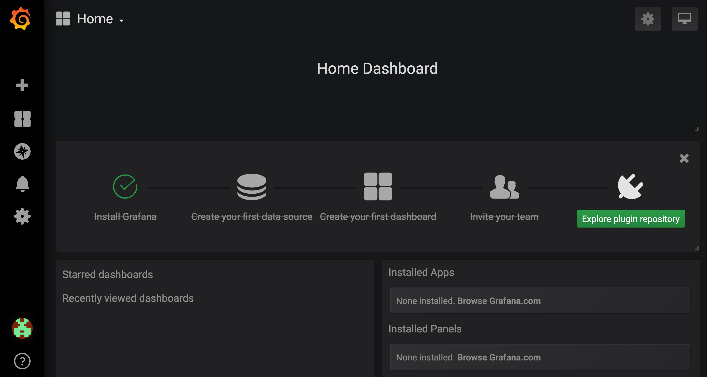

Now, let's create a dashboard to monitor the Chaos Metrics.

`*Click on  'plus (+) sign' > 'Create Dashboard' in the left hand side menu*`

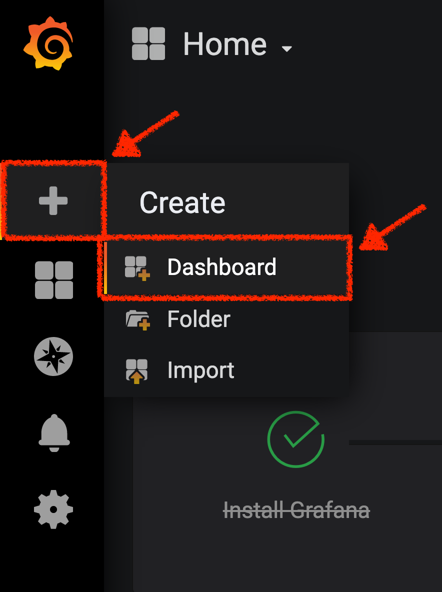

== Create the Global Request Volume Metric

Let's create the first **metric which defines the number of total requests in your namespace**.

`*Click on the 'Add Query'*`

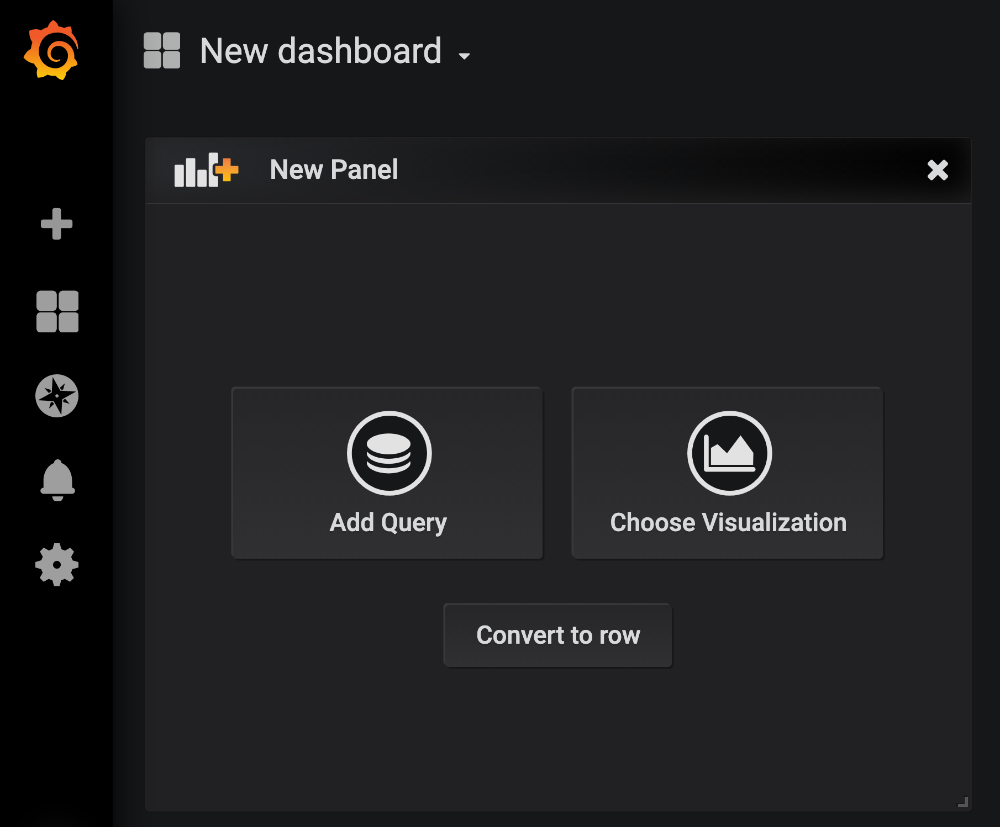

You are going to define the metric using a query language called Prometheus Query Language (**PromQL**).
This language will let you select and aggregate time series data in real time.

You will use the following incremental approach to understand and translate the first metric to PromQL expressions.

`*Create incrementally the PromQL expression by following the 4 next steps and enter the expression into the 'Metrics' field for the Query 'A'*`:

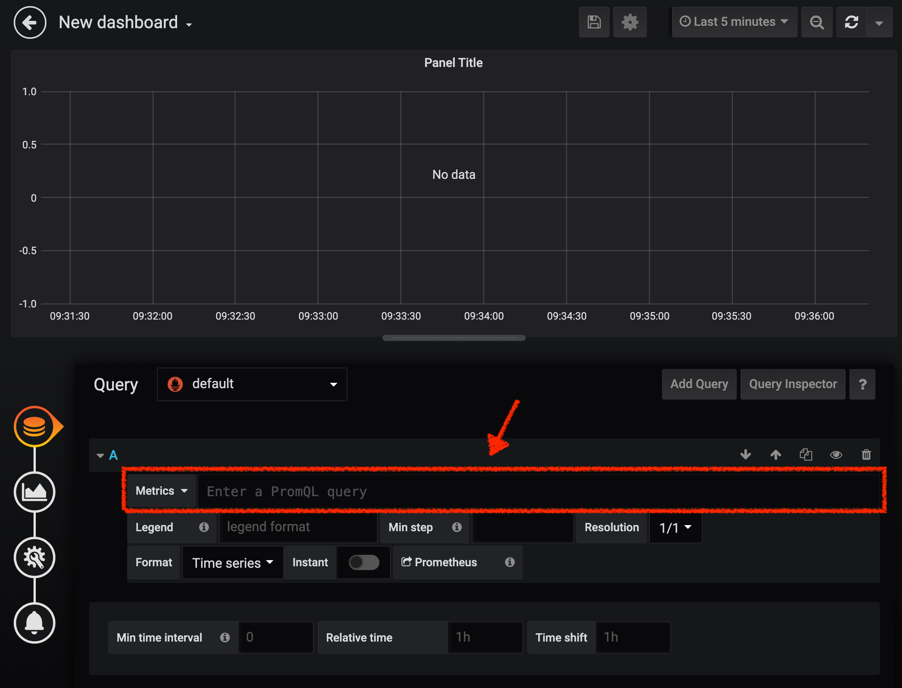

[tabs]
====
Step1::
+
--

[source,promql,subs="{markup-in-source}",role=copypaste]
.PromQL
----
**istio_requests_total**
----

This is an https://istio.io/latest/docs/reference/config/metrics/[Istio standard metric^] exported to Prometheus by default.
It is a Counter measuring the total number of requests that have come through the Entire Service Mesh. This metric has several 
dimensions, per time series in a range vector
--

Step2::
+
--

[source,promql,subs="{markup-in-source}",role=copypaste]
.PromQL
----
istio_requests_total**{reporter="source", namespace="chaos-engineering{USER_ID}"}**
----

Filter the metric to use only the inbound requests (_reporter="source"_) from your environment (_namespace="chaos-engineering{USER_ID}"_)
--

Step3::
+
--

[source,promql,subs="{markup-in-source}",role=copypaste]
.PromQL
----
**increase(**istio_requests_total{reporter="source", namespace="chaos-engineering{USER_ID}"}**[1m])**
----

Adding **increase()** function, the query returns the only number of requests as measured over the last minute per time series.
--

Step4::
+
--

[source,promql,subs="{markup-in-source}",role=copypaste]
.PromQL
----
**sum(**increase(istio_requests_total{reporter="source", namespace="chaos-engineering{USER_ID}"}[1m])**)**
----

Adding **sum()** function, the query returns the total of requests within the namespace
--

====

At the end, you should have the following expression in the the 'Metrics' field for the Query 'A'.

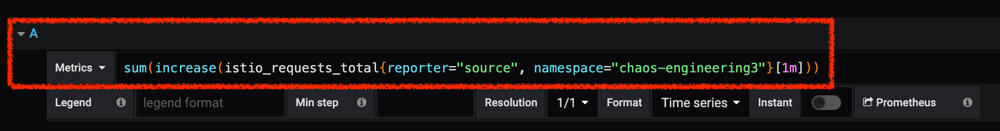

As result, you should be a time graph similar to the following one:

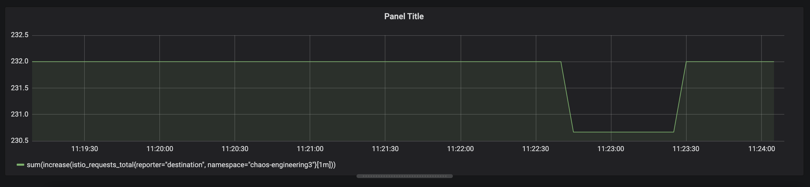

Then, `*click on 'Visualization Settings' icon on the left hand sidebar and enter the following parameters:*`

.Singlestat Settings
[%header,cols=3*]
|===
|Parameter
|Value
|Description

|Visualization 
|**Singlestat**
|

|Unit 
|**Throughput ops/min (opm)**
|

|Spark Lines
|**Show** enabled
|

|===

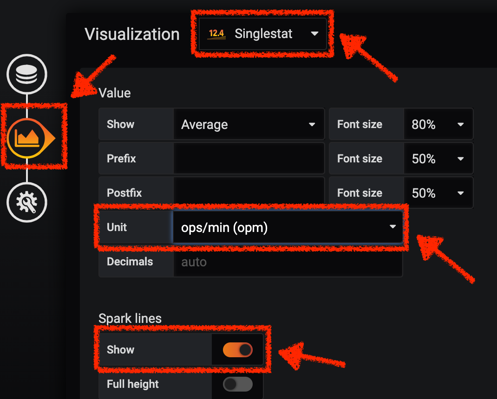

Finally, `*click on the 'General Settings' icon and enter the following parameters:*`

.General Settings
[%header,cols=3*]
|===
|Parameter
|Value
|Description

|Title 
|**Global Request Volume**
|

|===

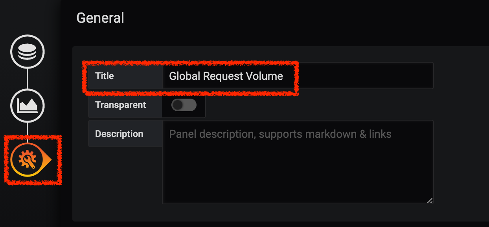

**Congratulations!!!** You just created your first Chaos Metric in a Grafana dashboard!

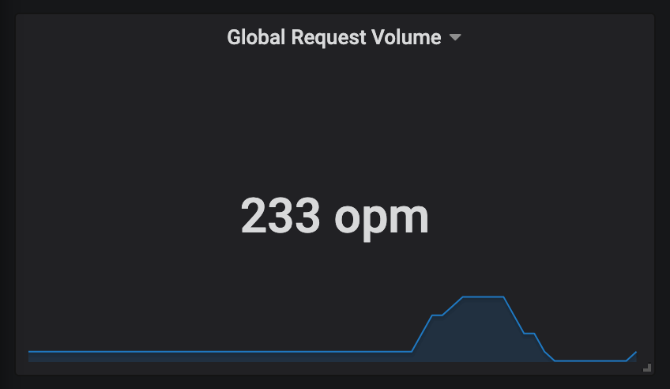    

**Grafana** allows to use https://prometheus.io/docs/prometheus/latest/querying/functions/#functions[Functions like rate or increase, etc...]

== Create the Global Success Rate Metric (Optional)

After creating the metric of all requests, you are going to define a **metric of all successfull requests** (~ error code 5XX) for 1 minute :

 Total Requests: sum(rate(istio_requests_total{}[$time_interval]))

 Successful requests: sum(rate(istio_requests_total{response_code!~"5.*"}[$time_interval])) 
 in our case :

_sum(rate(istio_requests_total{reporter="source", namespace="chaos-engineering{USER_ID}", response_code!~"5.*"}[1m]))/ sum(rate(istio_requests_total{reporter="source", namespace="chaos-engineering{USER_ID}"}[1m]))_

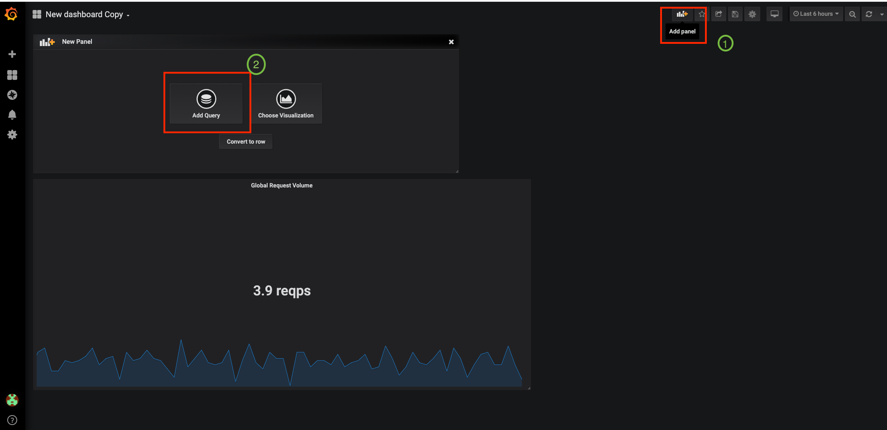

Now let's create this new **Global Success Rate (non 5xx responses) ** METRIC value 

`*Click on the (1) 'Add Panel' button*`

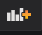

and 

`*Click on the (2) 'Add Query' icon*`

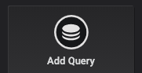

`*Enter the following expression into the 'Metrics' field for the Query 'A'*`:

[source,promql,subs="{markup-in-source}",role=copypaste]
.PromQL
----
sum(rate(istio_requests_total{reporter="source", namespace="chaos-engineering{USER_ID}", response_code!~"5.*"}[1m]))/ sum(rate(istio_requests_total{reporter="source", namespace="chaos-engineering{USER_ID}"}[1m]))
----

[TIP]
====
**Global Success Rate**  is a ratio betwen the number of successfull request and the number of http requests.
====

Then, `*click on 'Visualization Settings' icon on the left hand sidebar and enter the following parameters:*`

.Singlestat Settings
[%header,cols=3*]
|===
|Parameter
|Value
|Description

|Visualization 
|**Singlestat**
|

|Unit 
|**percent (0.0-1.0)**
|

|Thresholds 
|**95,99,99.5**
|

|Spark Lines
|**Show** and **Full height** enabled
|

|===

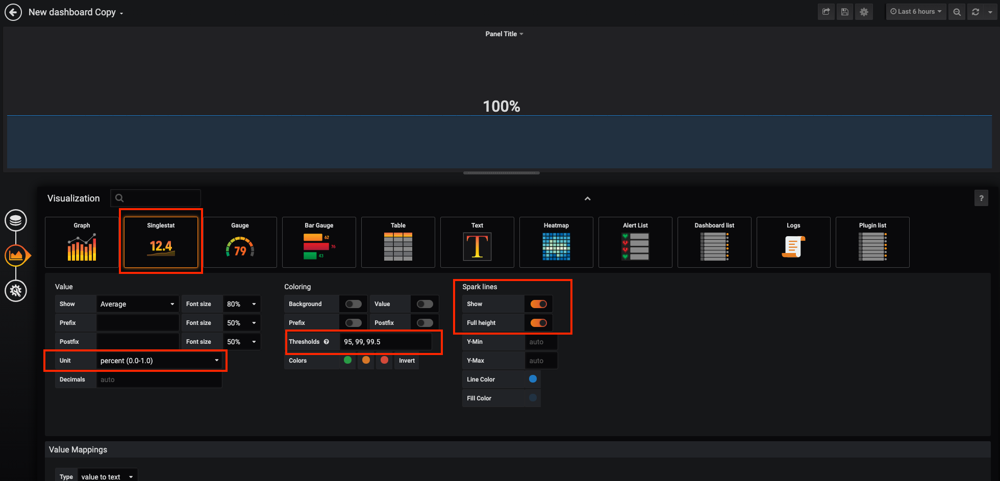

Finally, `*click on the 'General Settings' icon and enter the following parameters:*`

.General Settings
[%header,cols=3*]
|===
|Parameter
|Value
|Description

|Title 
|**Global Success Rate (non 5xx responses)**
|

|===

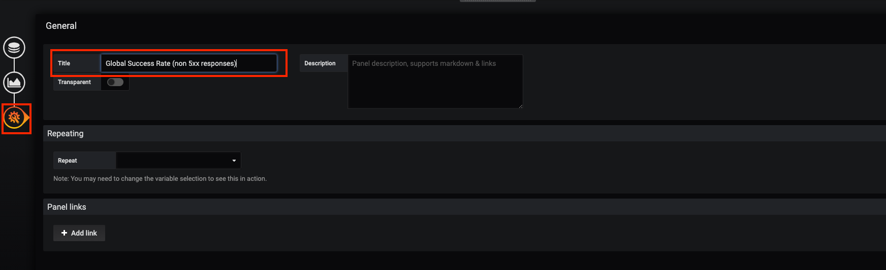

**Congratulations!** You just created your second Chaos Metric **Global Success Rate (non 5xx responses)** in a Grafana dashboard!

== Import the Chaos Engineering Dashboard

You just learnt how to create a Grafana Dashboard. Now, let's import the full Grafana Dashboard needed to the chaos experiments.

`*Click on the following link, {DASHBOARD_GIT_URL}[Chaos Engineering Dashboard^, role='params-link'] and copy the content*`

In {GRAFANA_URL}[Grafana^, role='params-link'], `*Click on  'plus (+) sign' > 'Import Dashboard' in the left hand side menu*`

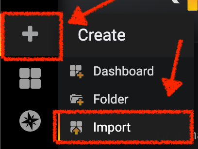

Then, `*paste the JSON content and click on 'Load' > 'Import'*`

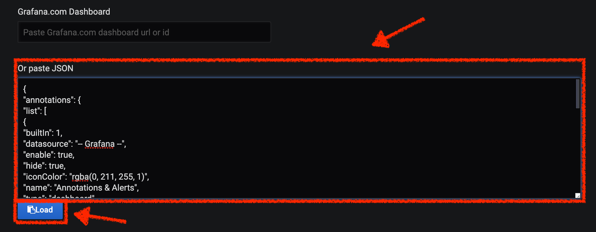

If you are receiving an error mentioning ** A dashboard in this folder with the same name already exists**  add  'user{USER_ID}'in the Name 

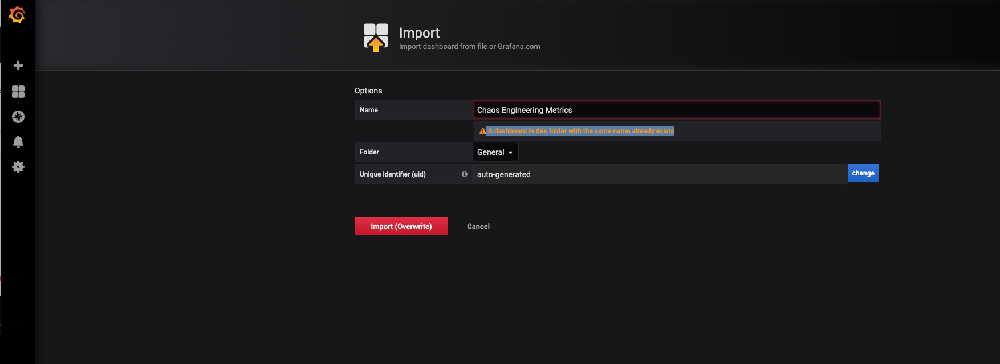

You have now access the Chaos Engineering Dashboard.

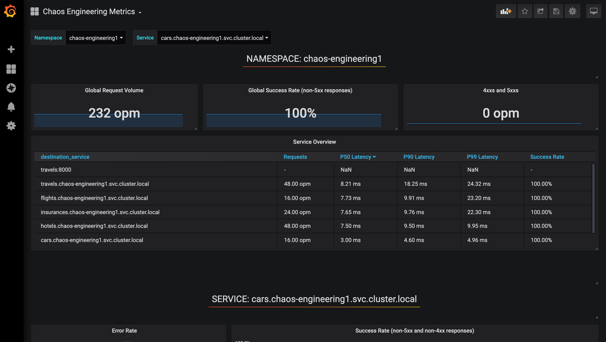

== Explore the Chaos Engineering Dashboard

Find here the full Grafana Dashboard imported 

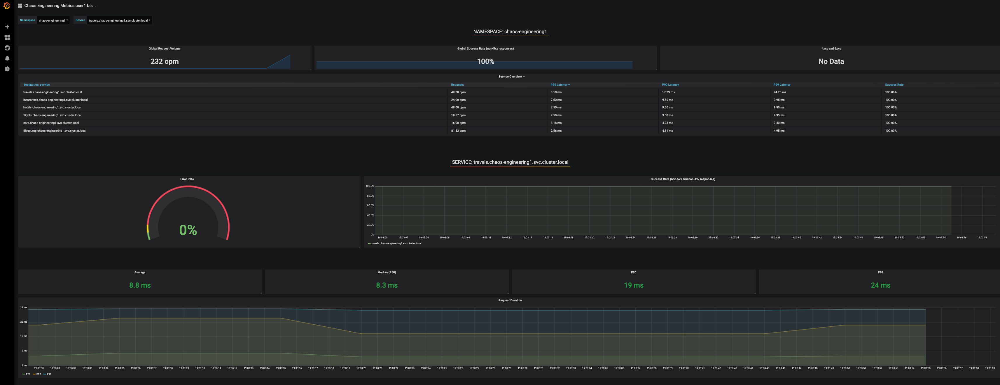

To explore this Dashboard we can see it as : 

* [Red] one filter selection block in which we are selecting a namespace [Pink] here chaos-engineering{USER_ID} and a service [Cyan] of the Travel application 
* [Blue] Block A all metrics relative to the namespace on which the application is deployed
* [Yellow] Block B all metrics relative to a specified service

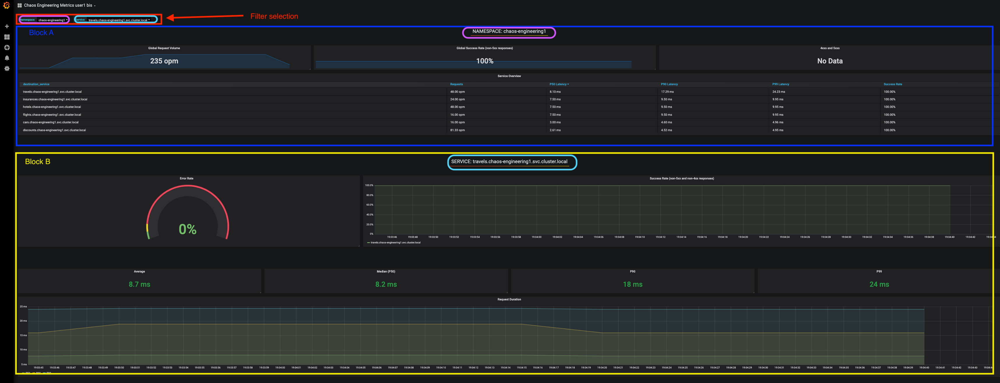

If we are zooming in Block A relative to the **NAMESPACE chaos-engineering{USER_ID}** we can see :

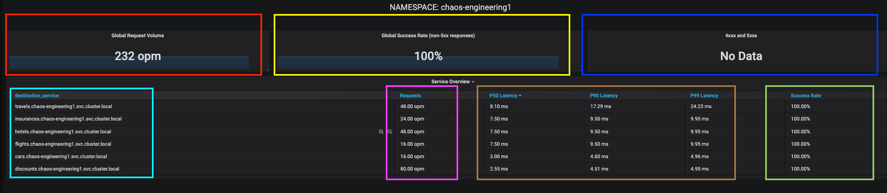

* [Red] Global Request Volume => the total number of requests
* [Yellow] Global Success Rate => A target ratio of successful requests over the total number of requests .
* [Blue] 4xx and 5xx => Total of requests in Error HTTP 4xx and 5xx
* [Cyan] list of all services name available in the namespace chaos-engineering{USER_ID}
* [Pink] Number of requests by services
* [Brown] Latency per services
* [Green] Success of requests per services => Ratio of successful request associated to the service
 

If we are zooming in Block B relative to the **SERVICE** selected we can see : 

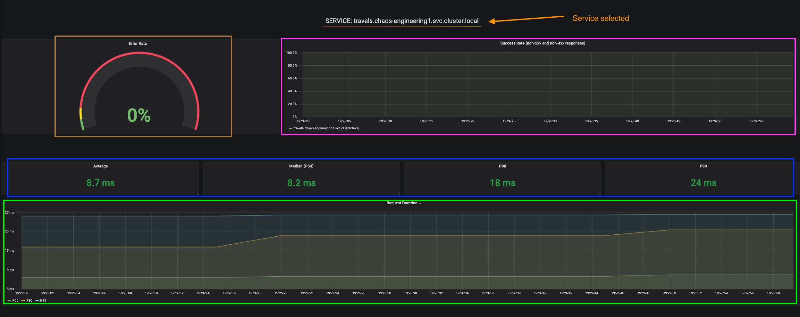

* [Brown] Error Rate in the service selected => Ratio of error associated to the service selected
* [Pink]  Success Rate => to identify WHEN HTTP error occur in the service call
* [Blue] Latency value for the service 
* [Green] Request Duration for the service

[IMPORTANT]
====
All metrics have to be measured over a time window (typically a month) but especially for this Workshop here we are taking the minute [1m] to see some change in the Dashboard. 
====