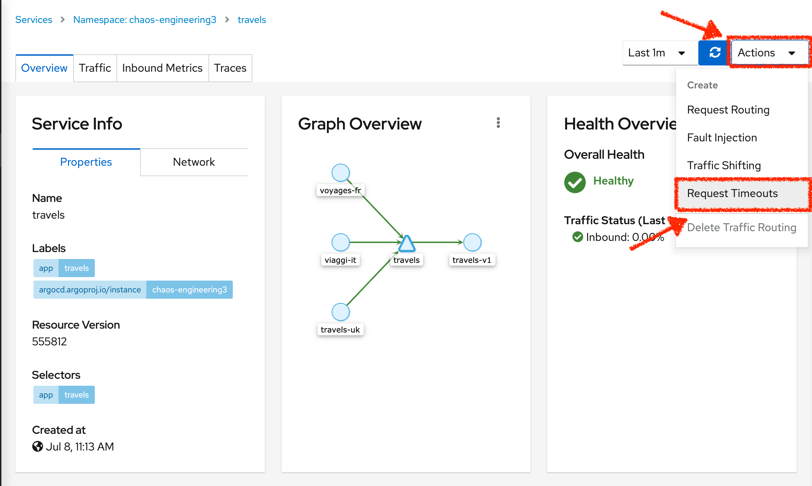
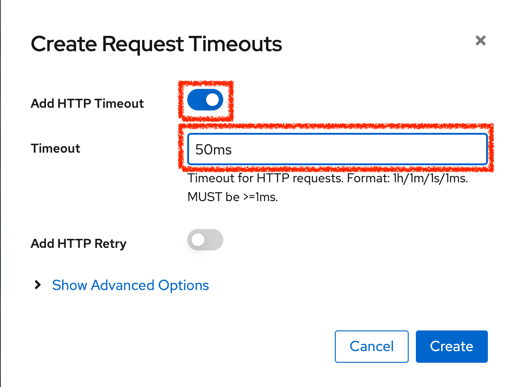
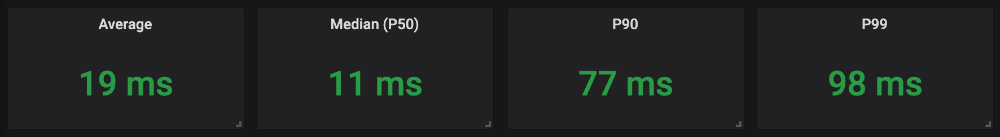
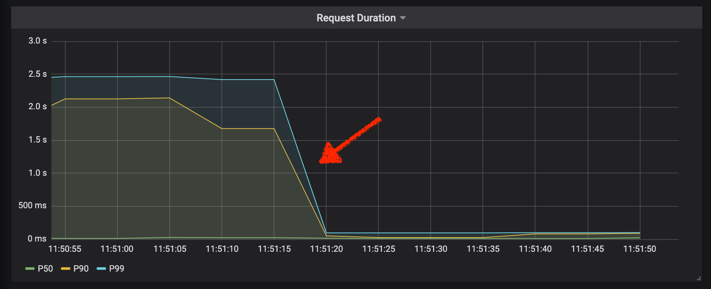
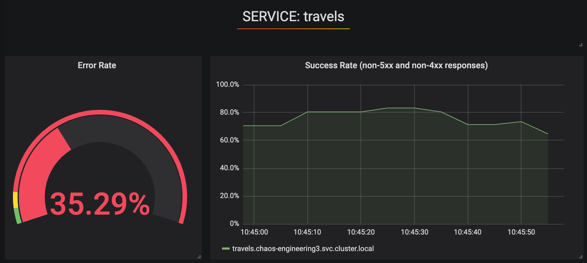
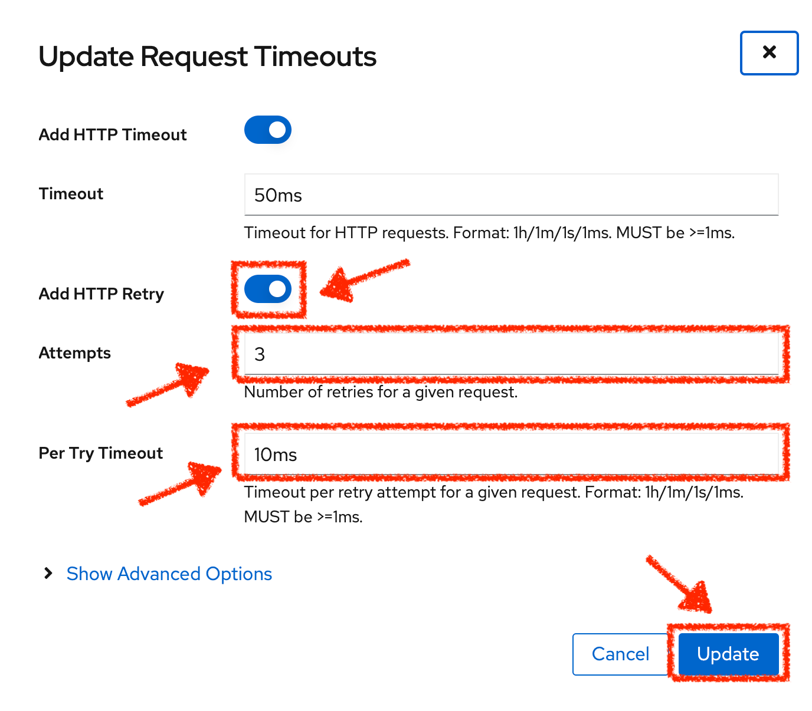

:markup-in-source: verbatim,attributes,quotes
:CHE_URL: http://codeready-workspaces.%APPS_HOSTNAME_SUFFIX%
:USER_ID: %USER_ID%
:OPENSHIFT_PASSWORD: %OPENSHIFT_PASSWORD%
:OPENSHIFT_CONSOLE_URL: https://console-openshift-console.%APPS_HOSTNAME_SUFFIX%/topology/ns/chaos-engineering{USER_ID}/graph
:APPS_HOSTNAME_SUFFIX: %APPS_HOSTNAME_SUFFIX%
:KIALI_URL: https://kiali-istio-system.%APPS_HOSTNAME_SUFFIX%
:GRAFANA_URL: https://grafana-istio-system.%APPS_HOSTNAME_SUFFIX%

= Chaos Experiment 1: Injecting Timeout

_XX MINUTE PRACTICE_

== TODO

To minimize the latency impact, you can use the **timeout pattern** which is probably the most common resilience pattern for distributed systems.
The goal is to fail a request after a certain period of time to avoid code and resources locking when the service is waiting for a response that takes too long or that might never arrive.

In the {KIALI_URL}[Kiali Console^], from the **'Services' view**, `*click on the 'travels' > 'Actions' > 'Request Timeouts'*`

`*Add HTTP Timeout by entering the following settings:*`

.HTTP Timeout Settings
[%header,cols=3*]
|===
|Parameter
|Value
|Description

|Add HTTP Timeout 
|**Enabled**
|

|Timeout
|**50ms**
|

|===

In {GRAFANA_URL}[Grafana^], from the **Chaos Engineering Dashboard**, `*scroll down and see the latency metrics*`

After a while, you can see the impact of our configuration. Indeed, the latency on **Travels** service has reduced and
the latency metrics become green again.

The latency issues have been fixed but the timeout pattern introduces errors for the requests which exceeds the threshold.
`*Scroll up and see the error rate metrics*`

== TODO

You have implemented timeouts for the travels service. 
Let's implementing a strategy of retry to mitigate these transient errors.

In the {KIALI_URL}[Kiali Console^], from the **'Services' view**, 
`*click on the 'travels' > 'Actions' > 'Request Timeouts' and add HTTP Retry by entering the following settings:*`

.HTTP Retry Settings
[%header,cols=3*]
|===
|Parameter
|Value
|Description

|Add HTTP Retry 
|**Enabled**
|

|Attempts
|**3**
|

|Per Try Timeout
|**10ms**
|

|===

`*Back to {GRAFANA_URL}[Grafana^]*`, you can tell the retry pattern reduces the error rates without impacting the latency.

